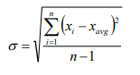
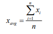
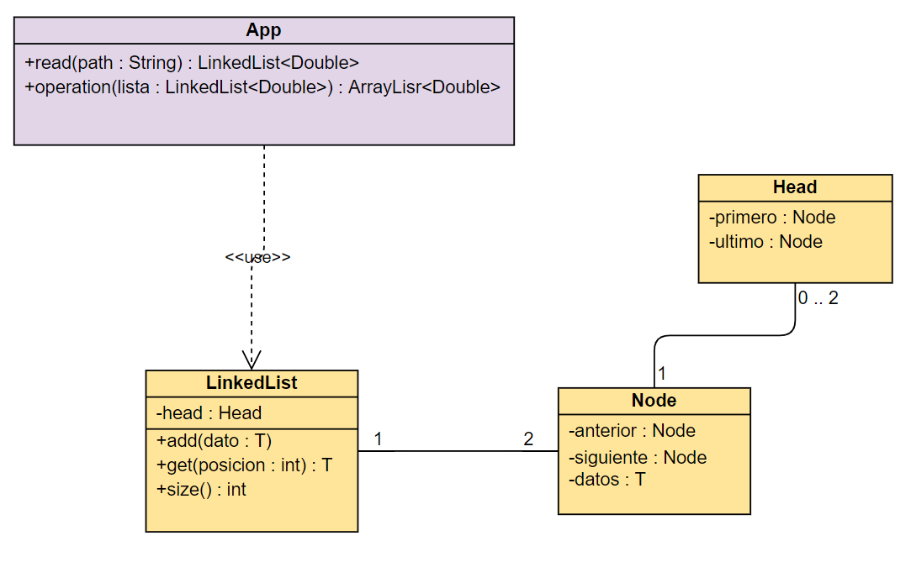

# Laboratorio 2 AREP

## Empezando

>Para clonar el archivo 

git clone https://github.com/nontoa/LAB2-AREP.git
>
### Prerrequisitos
* Maven
* Java
* Git

## Construido con

* [Maven](https://maven.apache.org/) - Gestión de dependencias

## Descripción del programa:

### Formulas utilizadas para los calculos:

#### Desviación estandar:

#### Media:

### Diagrama de la implementación:

## Autor

* **Juan Nicolas Nontoa Caballero**  LAB2-AREP - [nontoa] (https://github.com/nontoa)

## licencia

Este proyecto está licenciado bajo la Licencia GNU - vea el archivo [LICENSE](LICENSE) para más detalles.

